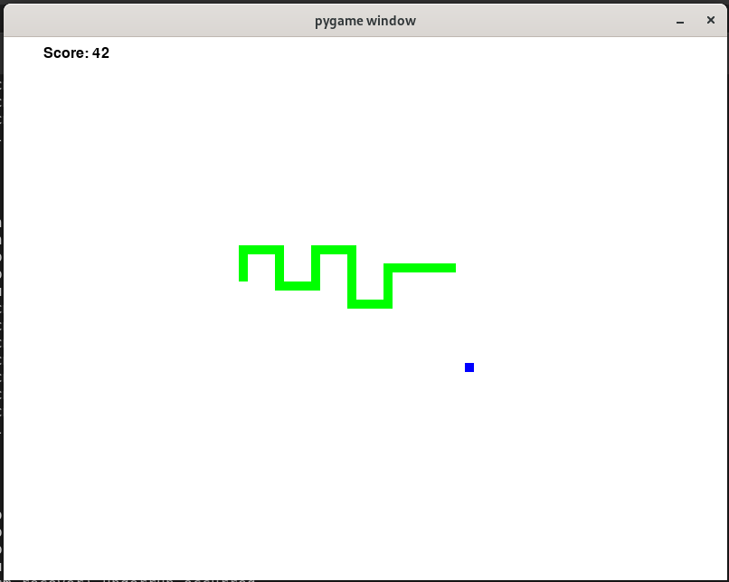

# Snake Game  
  
 &nbsp;&nbsp; 
  
snake_game.py is a Snake Game code produced by prompting the OpenAI Codex engine. 
Codex is an AI system that translates natural language to code. In this case it's Python code.
The prompt is a text snippet that is fed to the Codex engine for completion. Completed text is a program code or script, etc.

**The prompt**
>#Define a python function which is a classic snake game.\
>#Display playing field using pygame library.
>
>import pygame
  
  
**Prompt parameters**
>Temperature: 0.7\
>Top P: 1\
>Frequency penalty: 0\
>Presence penalty: 0\
>Best of: 1

(Response length can be adjusted as needed)

Gameplay:
Use arrow buttons to navigate the snake. Eat the food that appears at random locations.
